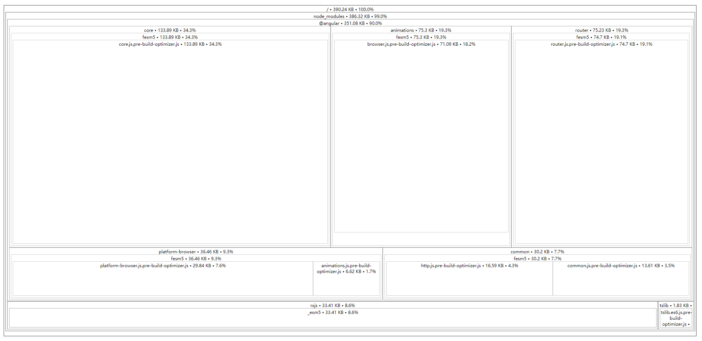
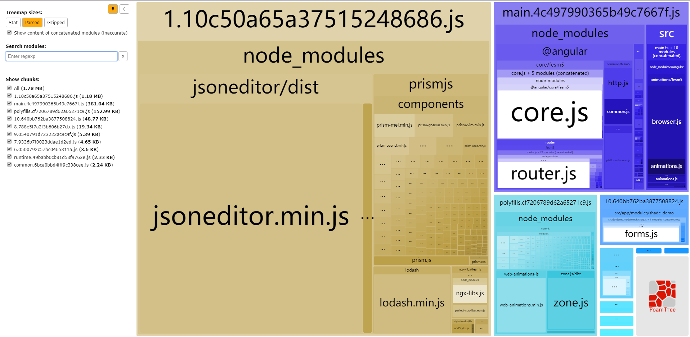

# 项目的说明
- 这是一个基于ng7版本的工程，使用cli功能自己做了一个组件包供自己引用。在这边可能没什么意义，但可以自己搭建一个npm服务器，将组件包放进去，就可以像常规组件，第三方插件一样使用和管理。
- 这边版本直接为7.0.0，是因为想大版本跟ng保持一致，而小版本就主要跟项目自身相关了。

# 项目的使用
1. 首先在github上获取代码：通过git命令 `git clone https://github.com/wjx774326739/ngx-libs-demo.git` 克隆仓库，或者直接下载代码压缩包;
2. 安装依赖包：`npm install `
3. 运行示例工程：`npm start`
4. 当前工程中，创建了一个子工程ngx-libs，代码在根目录下projects中。我将通过该子工程，实现对组件的封装和打包，最终得到一个.tgz格式的压缩文件。通过对该文件的引用，将实现类似于常规第三方库的引用和管理。
5. 相应的命令已经写好，具体见*package.json*中的*scripts*部分中的“gene:lib”和“package:ngx-libs”命令。
6. 当执行` npm run gene:lib `命令时，将创建一个类似ngx-libs的子工程。
7. 当执行` npm run package:ngx-libs `时，将对子工程ngx-libs进行一系列的操作，包含代码的编译` npm run build:lib ngx-lib `、将编译后的代码打包成.tgz的压缩文件等。打包后的文件默认存放在根目录下的libs的同名文件夹中。因为我已通过该命令对这些操作进行整合，所以只要运行该命令便可。如果想对其中一些设置进行调整，该相应的命令便可。
8. 因为这些命令中使用了一些linux命令，因此如果在win环境下，建议使用 git bash（安装时需勾选相应的配置）等支持linux命令的终端运行。
9. 当想对ngx-libs中的组件进行调整，并在使用示例中查看时，在调整完组件内容后，运行` npm run package:ngx-libs `命令便可，会自动替换node_modules中的代码。
10. 因为.tgz压缩文件为二进制文件，git无法识别前后差异，因此谨慎提交打包后的.tgz文件，否则后期git日志文件可能变得很大。因此工程中的libs文件夹中的.tgz文件本人也不能保证时最新的，下载本工程后，最好执行` npm run package:ngx-libs `命令确保node_modules中的为最新代码。

# 项目部署
- 以开发模式编译部署整个示例工程：执行命令：`npm run build`
- 以生产模式模式编译部署整个示例工程：执行命令：`npm run build:prod`

# 快速调试
- 使用ngx-libs中的组件等，默认是调用node-modules中的代码。这在开发过程中可能会造成不便。当需要直接调试ngx-libs中的组件时，可按下面的说明进行调整：
1. src\tsconfig.app.json中，compilerOptions.paths节点中增加配置：` "ngx-libs": ["../projects/ngx-libs/src/public_api.ts"] `；

# 打包优化
- 打包构建成生产环境的代码是必然遇到的场景。减小打包后文件的体积，加快内容的加载，是必然得需求。这边引入了两个常用的打包后分析插件source-map-explorer和webpack-bundle-analyzer。可以用于分析打包后生成的文件的内容组成，从而有针对性的进行打包优化，去除无用的内容。
## source-map-explorer
- 使用该插件，在打包时，需要同步生成.map文件，才能对每个js、css文件进行分析。具体可见官网(https://github.com/danvk/source-map-explorer)；
- 打包时生成.map文件的命令：`ng build --prod --source-map`；
- 分析打包后的文件的命令：`node_modules/.bin/source-map-explorer dist/main.*.js`。其中`dist/main.*.js`是要分析的文件，比如这边是main.js文件，因为打包时文件名加了hash，所以中间以*模糊化处理。
- 效果图

## webpack-bundle-analyzer
- 使用该插件，在打包时，需要同步生成stats.json文件，才能对每个js文件进行分析。具体可见官网(https://github.com/webpack-contrib/webpack-bundle-analyzer)；
- 打包时生成stats.json文件的命令：`ng build --prod --stats-json`;
- 分析打包后的文件的命令：`node_modules/.bin/webpack-bundle-analyzer dist/stats.json`；
- 为了方便，在package.json的scripts中写了一个命令，方便在打包时时直接分析打包后的命令：`npm run build:prod:analyze:webpack-bundle-analyzer`;
- 效果图

# 组件模块的引入
- ngx-libs提供两种引入方式，一种是引入NgxLibsModule模块，另一种是引入对应的组件模块（如NgxShadeModule，NgxPrismjsModule等）。
- 如果用引入NgxLibsModule模块的方式使用组件，则可以使用全部的组件，不管是ngx-shared还是ngx-perfect-scrollbar，不用再引入相关的组件模块。但是会造成的影响是，打包构建后可能会使打包后生成的文件体积变大。因为Angular中的摇树优化目前还有局限性，一些第三方js插件虽然没用使用到，还是会被打包进去，比如moment.js。
- 如果用引入相关模块的方式使用组件，则每使用一种组件，需要引入相关的组件模块才行。过程会繁琐点，但是相对的，不会造成无用的组件模块打包构建后造成生成的文件体积变大的问题。
- 根模块以及在根模块中急性引入的模块推荐按需引入。懒加载的模块推荐使用NgxLibsModule引入。因为懒加载的模块会经过分析，将组件拆分成多个js文件，在需要的时候才加载相关的js文件。而根模块中的内容打包后为main.js中的内容，是访问项目是最先开始加载的。如果main.js体积过大，会造成用户访问速度变慢的问题。因为根模块的内容和其它懒加载的模块不同，根模块中的内容是第一时间加载，并运行起来的，因此它自身需要引入所有依赖的代码，因此就造成可能main.js体积过大的问题；

# [ngx-libs更新日志](/projects/ngx-libs/changelog.md)

# [ngx-libs-demo更新日志](/src/changelog.md)

# 组件说明：
- [ngx-jsoneditor](/src/app/modules/jsoneditor-demo/readme.md)
- [ngx-perfect-scrollbar](/src/app/modules/perfect-scrollbar-demo/readme.md)
- [ngx-shade](/src/app/modules/shade-demo/readme.md)

# 指令说明
- [ngxPrismjs](/src/app/modules/prismjs-demo/readme.md)
